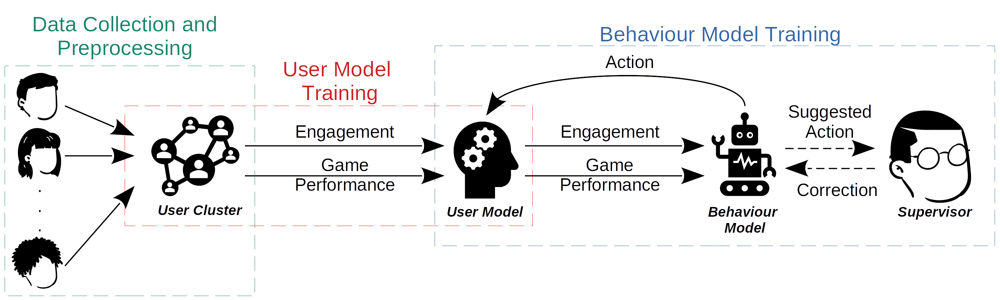

# migrave_personalised_behaviour_model
Personalised behaviour model that (i) is based on the concept of learning from feedback and guidance and (ii) incorporates learned user models that estimate a user's engagement and expected performance in an activity.

The behaviour model is implemented in the context of sequence learning game, thus the implementation is based on [this source](https://github.com/TsiakasK/sequence-learning-dataset).

For further explanation please refer to this [paper](https://arxiv.org/abs/2207.12144)
```
M. Stolarz, A. Mitrevski, M. Wasil, and P. G. Plöger, 
“Personalised Robot Behaviour Modelling for Robot-Assisted Therapy in the Context of Autism Spectrum Disorder,” 
in RO-MAN Workshop on Behavior Adaptation and Learning for Assistive Robotics (BAILAR), 2022.
```



The packages used for data collection and preprocessing are as follows:
* [migrave_models](https://github.com/migrave/migrave_models)
* [migrave_data_recorder](https://github.com/migrave/migrave_data_recorder)
* [migrave_ros_msgs](https://github.com/migrave/migrave_ros_msgs)
* [migrave_sequence_learning_game](https://github.com/migrave/migrave_sequence_learning_game)
* [migrave_perception](https://github.com/migrave/migrave_perception)

### Requirements:
```
numpy == 1.22.3
scikit-learn == 1.0.2
tensorflow == 2.8.0
pandas == 1.4.1
```

### Usage
* To preprocess the data use the jupyter notebooks available in `data_preprocessing`
* To run training of the user models:
  
  ```
  python3 user_models_training.py
  ```
Additionally, to plot the combined figures for both user models use the scripts `engagement_plotter.py` and `performance_plotter.py` in `user_model/output/model_plotter`.
* To run training of the behaviour model:

  ```
  python3 behaviour_model_training.py
  ```
  The parameters for behaviour model training can be set in `behaviour_model_params.py`. After the successful training, please run the following script in order to generate statistical analysis from all the runs (`behaviour_model` directory):
  ```
  python3 results_merger.py
  ```
  Extra scripts for plotting the training results can be found in `behaviour_model/results_plotting`.